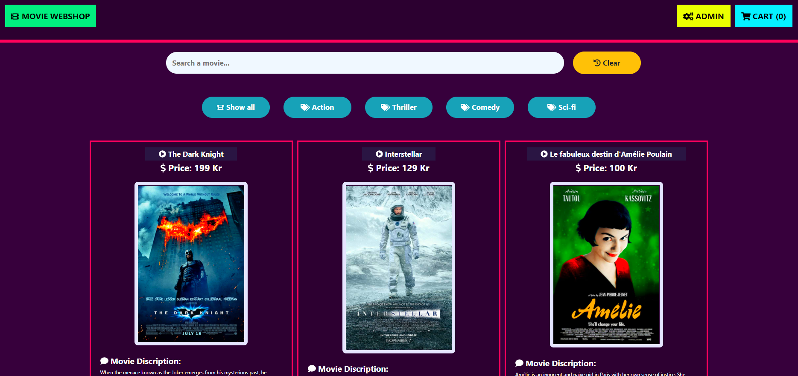

## Webshop Aplication With Angular: Interfaces &&& Services.

The webshop gets the products dynamically from an API then present the products.

**Contains the following fucntions:**
* Call items from an API.
* Add items to cart.
* Modify the quantity of items in cart.
* Delete from cart.
* Search panel (Search items by name).
* Categories (Sort items by genre).
* Check-out (Orders and customers details saved).

